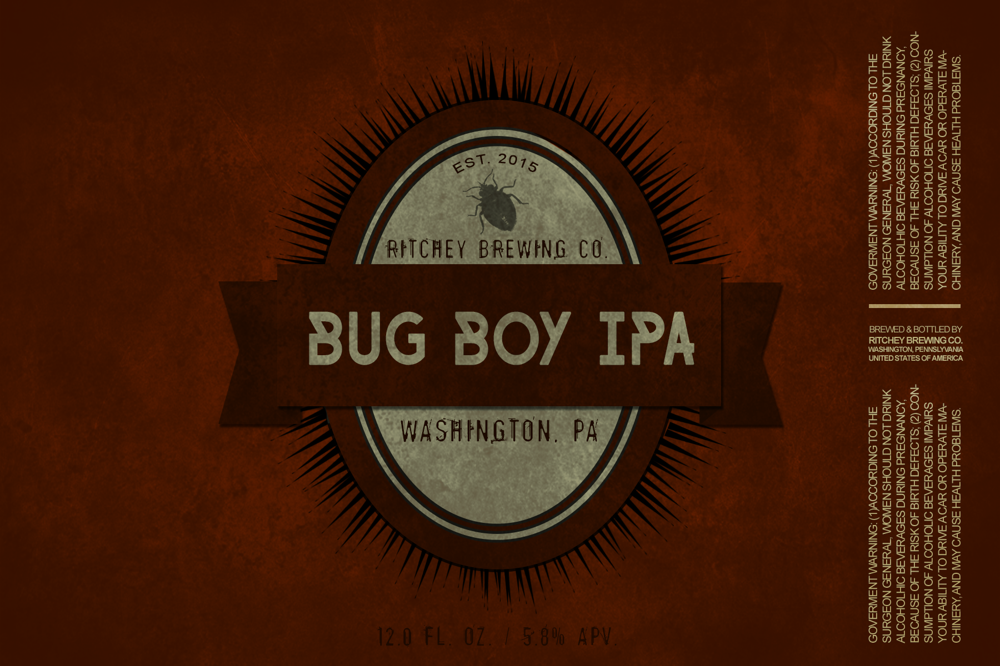

I created these beer labels for a brew hobbyist named Josiah. Josiash studied Environment Science, and had developed a "slight" affinity for all things insect. These labels reflected those interests.

These labels were completed in 2015.

Project type: Brand design, user research

Technologies used: Adobe Photoshop CC

