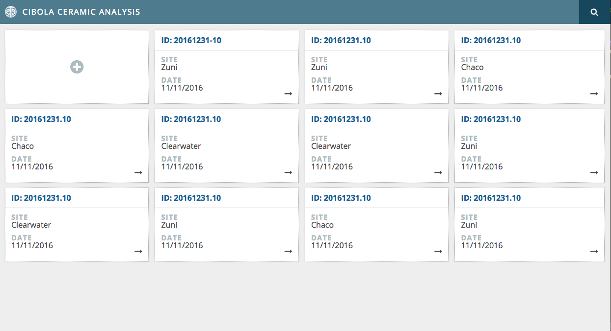
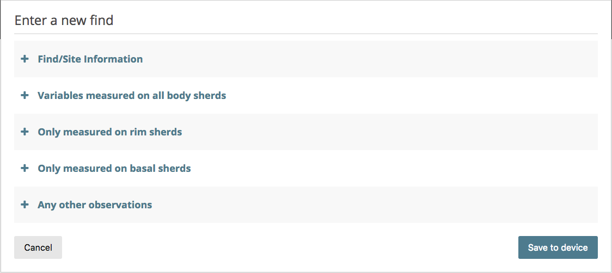
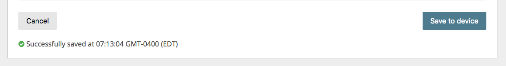

This project is a collaboration with <a href="http://samfee.net" target="_blank">Dr. Sam Fee</a> from <a href="https://washjeff.edu" target="_blank">Washington & Jefferson College</a> in Washington, PA. Archaeologist working in the field, in this case, the Southwest USA, often do not have access to an internet connection. This app would allow the scientist to collect data on their finds, replacing the existing paper method. A few benefits of this include data validation upon entry, local storage of the data that can later be synced to a remote service once a connection is established, and the ability to easily view and edit existing entries.

This application is in active development (2016-2018).

