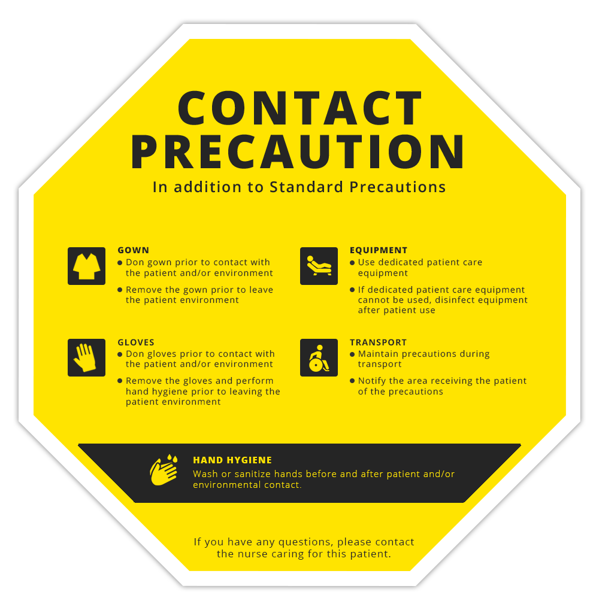

Often in hospitals, signs are attached to doors where specific precautions need to be taken when caring for a patient. These notices are often contain a lot of text, which can lead to them being ignored. This project is aimed at enhancing the design so that they catch attention and improve patient care.

This project was completed for <a href="https://ahn.org">West Penn Hospital</a>.

**Project type**: Graphic design  
**Technologies used**: Adobe Photoshop CC