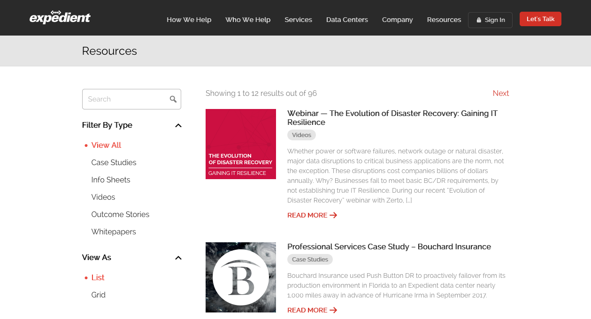

<a href="https://expedient.com" target="_blank">Expedient</a> is a leading IT infrastructure and managed service provider headquartered in Pittsburgh, with 11 data centers in 7 cities . Their services include cloud computing, DRaaS, and colocation. My role on the website was redesigning the resources page, incorporating Virtual Reality tours of their many data centers, and general maintenance and site management.

**Project type**: design, development  
**Technologies used**: Wordpress, HTML, CSS, jQuery, PHP, MySQL, Adobe Photoshop CC, Git, SVG

