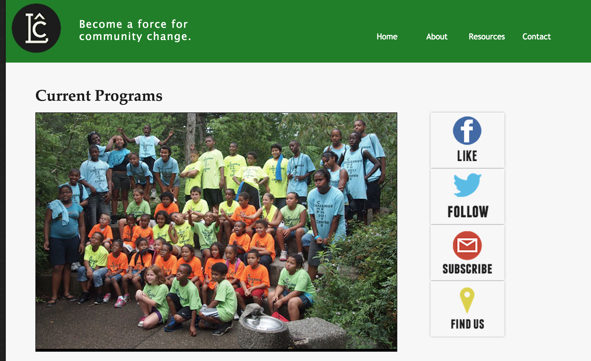

The LeMoyne Community Center's mission is to develop, shape, define, and stabilize the community with education, arts, health, and recreational programs. The site contains information, including events and the history of the center. My task was to come up with a design for the website, and write all the necessary code.

This site was retired in 2015, but I keep it

