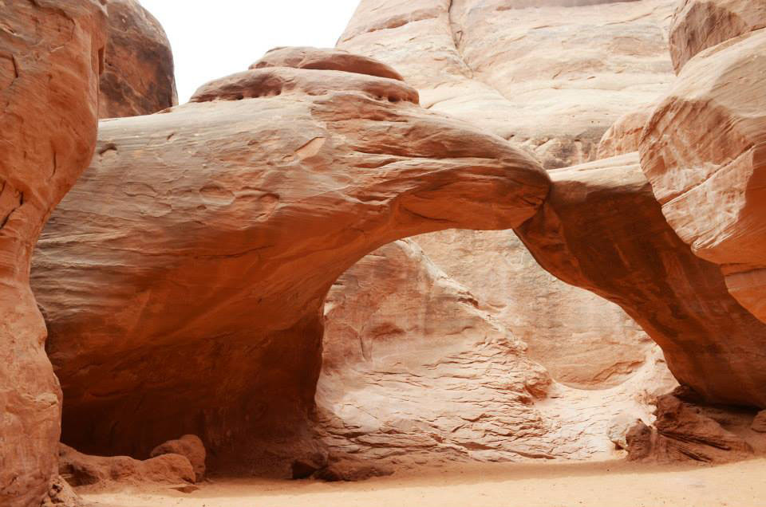
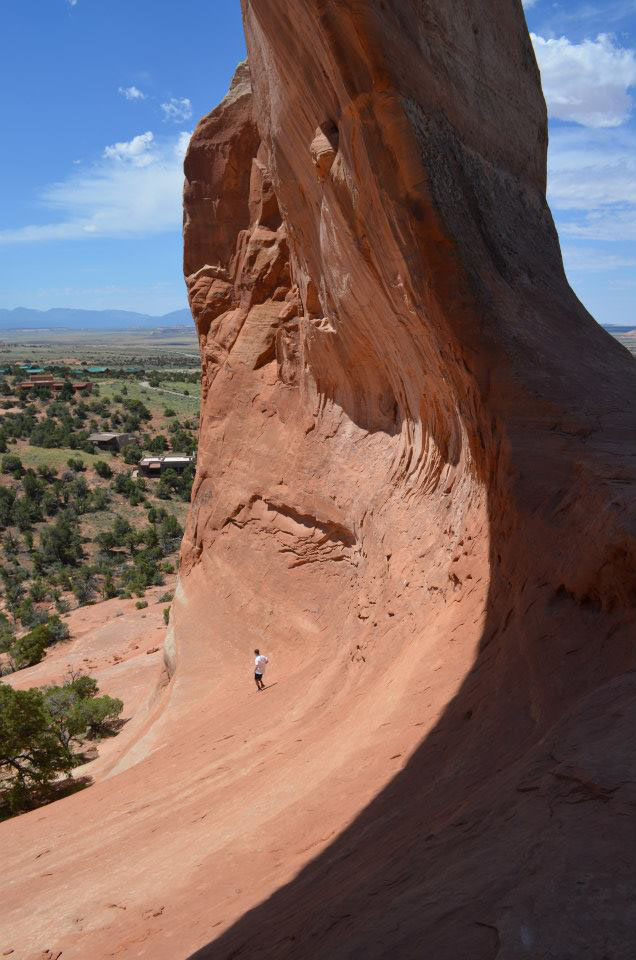
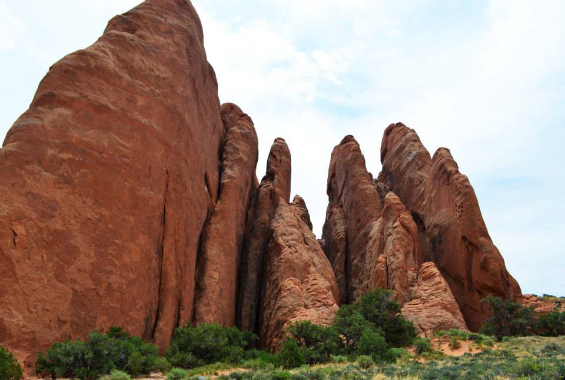
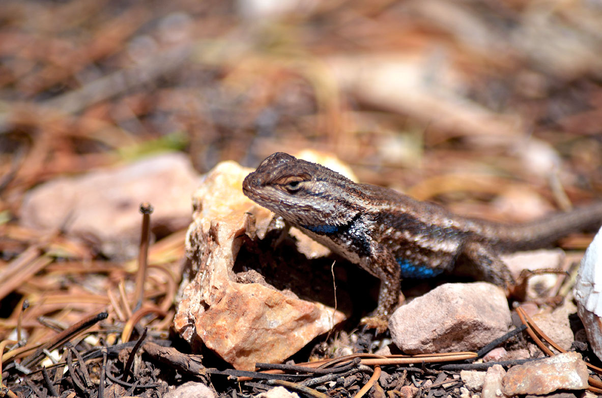
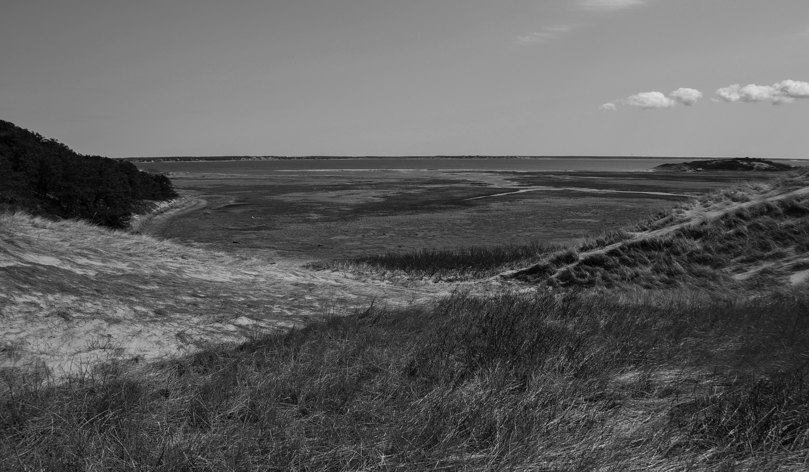
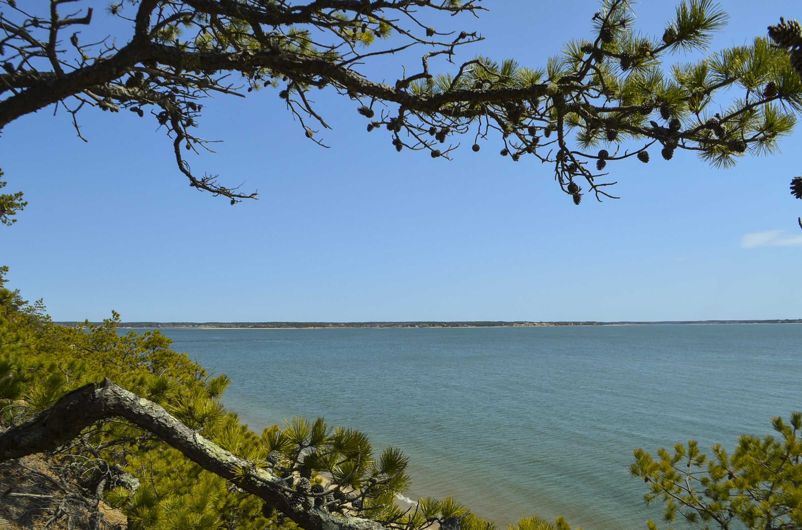
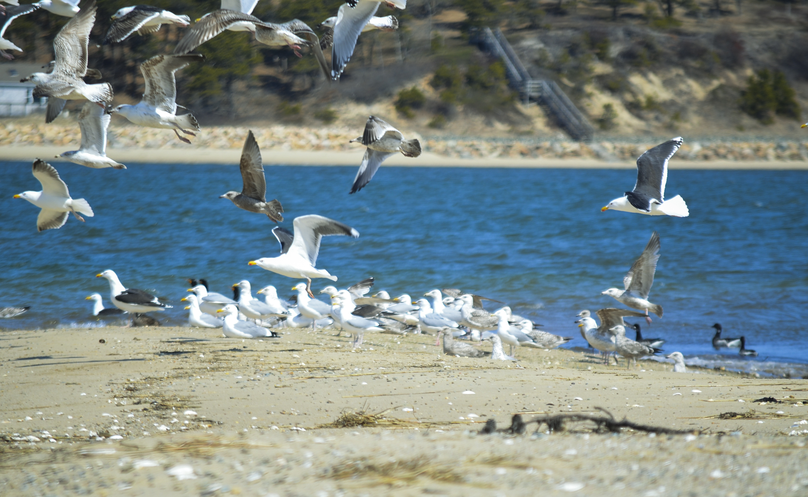
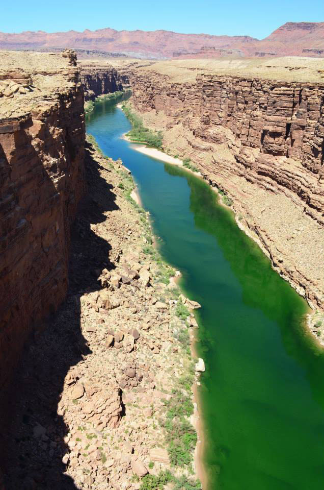
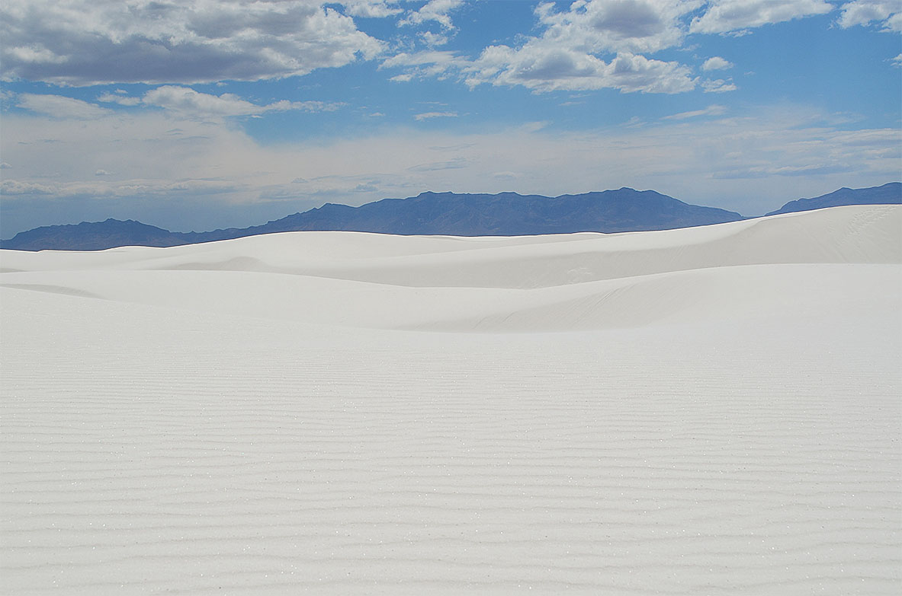
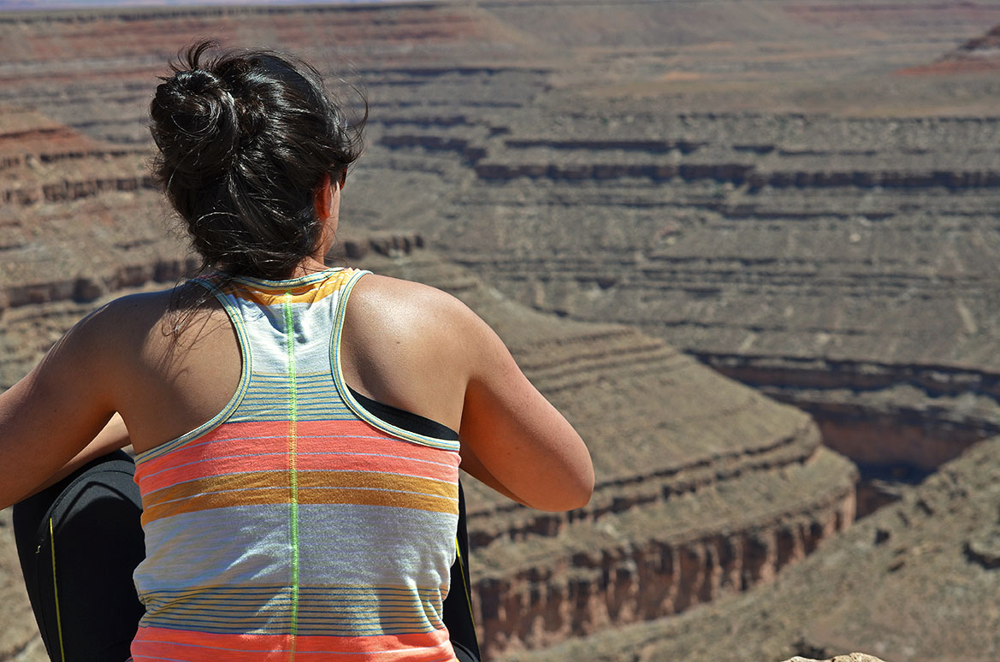

I've been fortunate enough to roadtrip around the United States a few times. These images reflect those journeys.

## Arches National Park, 2014

Project type: Graphic design
Technologies used: Adobe Photoshop CS6, Adobe InDesign

## Chaco Canyon

## Cape Cod

## Colorado River and Grand Canyon

## White Sands

## Goosenecks

