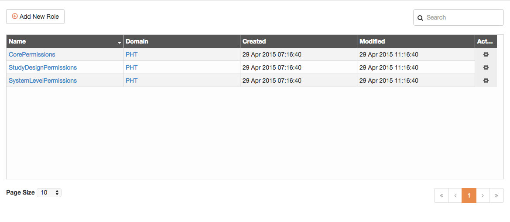
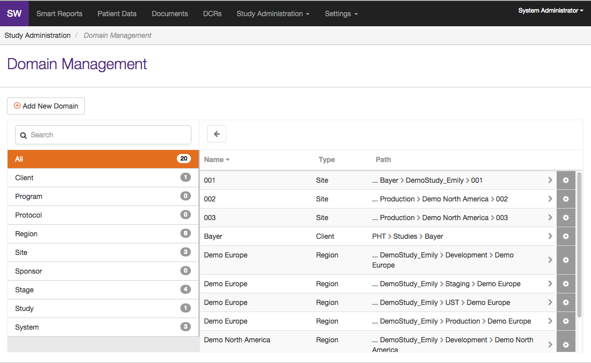
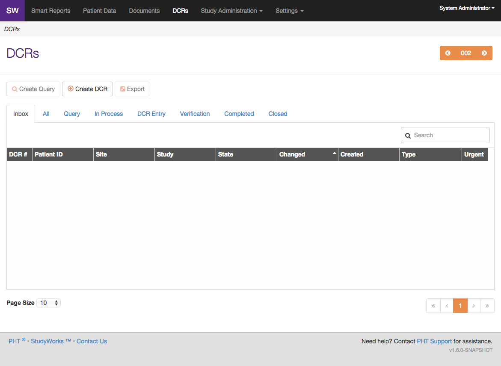

StudyWorks is a product of PHT® that is a "secure online portal of all Electronic Clinical Outcome Assessment (eCOA) data collected by any PHT device" (as is stated on the PHT Corp website). My role in the project was client-side development - building out the user interface and interacting with the powerful backend. Our team followed the Agile development cycle using two week iterations.

Project type: design, development
Technologies used: HTML, CSS, jQuery, JavaScript, AngularJS, LESS, Grunt, NPM, Bower, Git, Accurev, Karma/Jasmine, Adobe Photoshop CS6

PHT has since been acquired by the pharmaceutical corporation ERT®, where this particular project was discontinued. I have included it in my portfolio because it was my first large-scale professional project.

